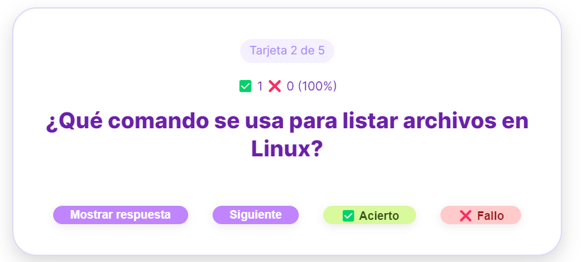
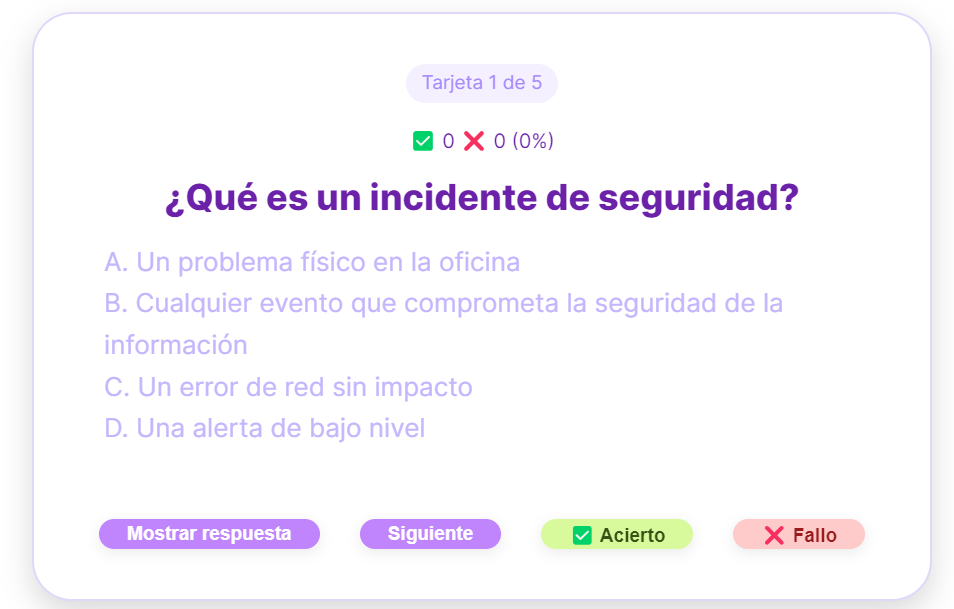
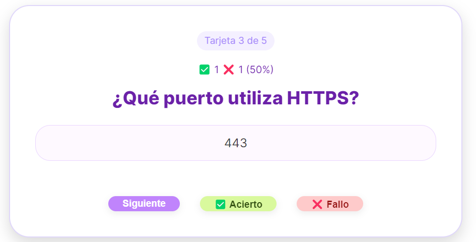
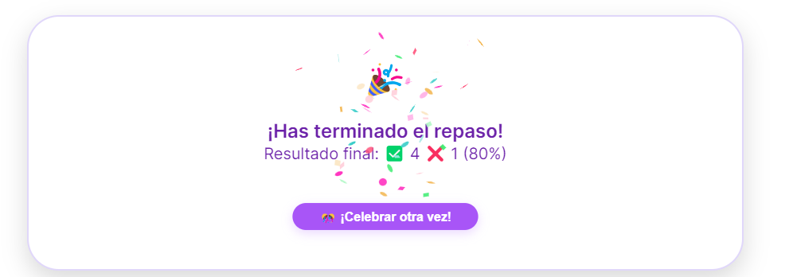

# Neuronotes 🧠💡

**Neuronotes** es un complemento para [Obsidian](https://obsidian.md) que permite estudiar con flashcards directamente desde tus notas. Está diseñado con especial atención a personas con TDAH: simple, directo y sin sobrecarga visual.  
Y lo mejor: al final de cada repaso te espera una celebración, porque cada paso cuenta y merece ser reconocido. 🎉

---

## ✨ Características

- Crea flashcards en tus notas con una sintaxis sencilla.
- Modal de repaso cómodo, tierno y visualmente armónico.
- Botones para marcar ✅ acierto y ❌ fallo durante el repaso.
- Contadores automáticos de progreso con porcentaje de aciertos.
- 🎉 Confetti pastel de celebración al terminar tu repaso.
- 🎊 Botón "¡Celebrar otra vez!" con animación diferente cada vez.
- Modal responsive y accesible para escritorio y móvil.
- Compatible con cualquier archivo Markdown en tu Vault.
- Ideal para repasar teoría técnica, vocabulario, definiciones clave, etc.

---

## 🌊 Sintaxis de las Flashcards

Dentro de cualquier nota, escribe tus tarjetas así:

```
%%card
Q: ¿Qué es una dirección IP?
A: Es un identificador único para un dispositivo en una red.
%%
```

También puedes crear flashcards tipo test (con opciones múltiples):

```
%%card
Q: ¿Cuál es la capa de red en el modelo OSI?
A. Aplicación  
B. Enlace de datos  
C. Red  
D. Sesión  
A: C. Red
%%
```

Puedes poner varias tarjetas en un mismo archivo.

---

## 🚀 Instalación

### Desde Obsidian (cuando esté aprobado por la comunidad):

1. Abre **Settings → Community Plugins**.
2. Activa *Safe Mode* si está desactivado.
3. Busca "**Neuronotes**" en el listado.
4. Haz clic en *Install* y luego en *Enable*.

### Instalación manual (opcional):

1. Descarga los archivos `main.js`, `manifest.json` y `styles.css` desde la [última release](https://github.com/ikikidev/neuronotes/releases).
2. Copia los archivos en `.obsidian/plugins/neuronotes` dentro de tu Vault.

---

## 🧠 Cómo usar Neuronotes

Una vez instalado y activado el plugin:

1. Asegúrate de que **Neuronotes** esté habilitado en `Settings → Community Plugins`.
2. Crea tarjetas en tus notas usando el siguiente formato:

   ```
   %%card
   Q: ¿Qué es una dirección IP?
   A: Es un identificador único para un dispositivo en una red.
   %%
   ```

3. Cuando quieras repasar tus tarjetas:
   - Presiona `Ctrl + P` (o `Cmd + P` en macOS) para abrir la paleta de comandos.
   - Escribe y selecciona **Neuronotes: Revisar flashcards**.
   - Se abrirá un modal donde podrás repasar las tarjetas con controles para:
     - ✅ Mostrar respuesta
     - ⏭️ Pasar a la siguiente
     - ✅ Marcar como acierto
     - ❌ Marcar como fallo

4. Al terminar:
   - Verás un resumen del progreso (aciertos, fallos y porcentaje).
   - 🎉 Se lanzará una animación de confetti adorable y suave.
   - 🎊 Puedes pulsar "¡Celebrar otra vez!" para una animación sorpresa.

Este flujo está diseñado para que puedas estudiar de forma rápida, visualmente clara y con una pizca de confetti al final.

---

## ☕ ¿Te gusta este plugin?

Si Neuronotes te resulta útil y quieres apoyar su desarrollo, puedes invitarme a un cafecito en:

👉 [https://ko-fi.com/ikikidev](https://ko-fi.com/ikikidev)

Tu apoyo ayuda a que pueda seguir creando soluciones techi accesibles y con 💖.

---

## 📄 Licencia

Este plugin se distribuye bajo la licencia [GPL-3.0](https://www.gnu.org/licenses/gpl-3.0.html).

---

## Previews

### 🗒️ Flashcard Simple



### 📝 Flashcard Test



### 💡 Mostrar respuestas 



### 🎉 Confetti final 

